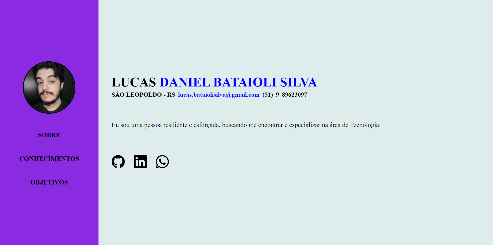

# Este repositório é a atividade final do Módulo Front End I do curso de Desenvolvimento Web Fullstack na [Growdev](https://www.growdev.com.br/programs/full-stack).

## Aqui está o produto final do projeto no qual foi ultilizado de maneira básica as seguintes tecnologias:

- **HTML**
- **CSS**

